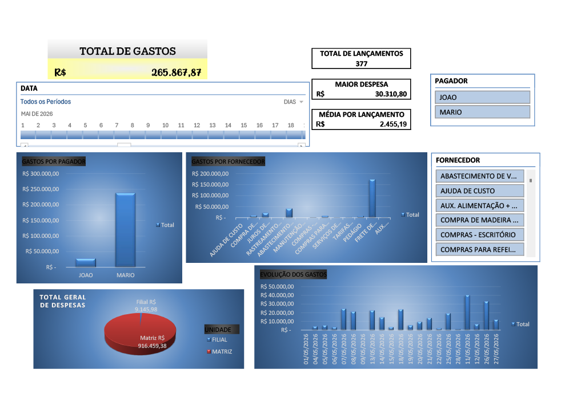

# Dashboard Financeiro em Excel

## Objetivo

Projeto desenvolvido para consolidar e analisar despesas financeiras utilizando Excel.

## Funcionalidades

- Dashboard interativo
- Tabelas Dinâmicas
- Gráficos Dinâmicos
- Segmentação de Dados
- Linha do Tempo
- Consolidação de Matriz e Filial

## Ferramentas Utilizadas

- Microsoft Excel
- Tabelas Estruturadas
- Tabelas Dinâmicas
- Dashboard Design

## Dashboard

## Principais Indicadores

- Total Geral de Despesas
- Total de Lançamentos
- Maior Despesa
- Comparativo Matriz x Filial
- Gastos por Pagador
- Gastos por Fornecedor
